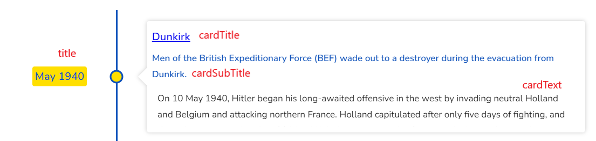

# Font Sizes

Customize the font sizes of different text elements within the timeline.

::: tip v3.0 Grouped API & Google Fonts
In v3.0, font sizes are configured through `style.fontSizes`. Additionally, v3.0 introduces `style.googleFonts` for dynamic Google Fonts integration with per-element weight and size control.

See [Grouped Configuration API](/api/grouped-config#style-configuration) for more details.
:::

All font size properties are optional and will use the component's default sizes if not specified.

## Font Size Properties

| Property     | Description                                           | Default  | Applied To                           |
| :----------- | :---------------------------------------------------- | :------- | :----------------------------------- |
| cardTitle    | Font size for the title within timeline cards        | `1.1rem` | Card title text                      |
| cardSubtitle | Font size for the subtitle within timeline cards     | `0.9rem` | Card subtitle text                   |
| cardText     | Font size for the detailed text content within cards | `0.85rem`| Card detailed text/content           |
| title        | Font size for the main timeline item titles          | `1rem`   | Timeline item titles (dates/periods) |

## Usage

### Basic Font Size Customization (v3.0)

```jsx
import React from 'react';
import { Chrono } from 'react-chrono';

const data = [
  {
    title: "January 2023",
    cardTitle: "Project Launch",
    cardSubtitle: "Phase 1 Complete",
    cardDetailedText: "Successfully launched the first phase of our project.",
  },
  {
    title: "March 2023",
    cardTitle: "Feature Expansion",
    cardSubtitle: "Phase 2 Development",
    cardDetailedText: "Added advanced features based on user feedback.",
  },
];

const Timeline = () => {
  return (
    <Chrono
      items={data}
      mode="vertical"
      style={{
        fontSizes: {
          cardTitle: '1.25rem',
          cardSubtitle: '1rem',
          cardText: '0.9rem',
          title: '1.1rem',
        }
      }}
    />
  );
};
```

::: details Using v2.x Syntax (Still Supported)
```jsx
<Chrono
  items={data}
  mode="VERTICAL"
  fontSizes={{
    cardTitle: '1.25rem',
    cardSubtitle: '1rem',
    cardText: '0.9rem',
    title: '1.1rem',
  }}
/>
```
:::

### Google Fonts Integration (v3.0 New Feature)

```jsx
const Timeline = () => {
  return (
    <Chrono
      items={data}
      style={{
        googleFonts: {
          fontFamily: 'Roboto',
          weights: [400, 500, 700],
          elements: {
            cardTitle: { weight: 700, size: '1.25rem' },
            cardSubtitle: { weight: 500, size: '1rem' },
            cardText: { weight: 400, size: '0.9rem' },
          }
        }
      }}
    />
  );
};
```

### Responsive Font Sizes

```jsx
const Timeline = () => {
  return (
    <Chrono
      items={data}
      fontSizes={{
        cardTitle: 'clamp(1rem, 2.5vw, 1.5rem)',    // Responsive title
        cardSubtitle: 'clamp(0.875rem, 2vw, 1.125rem)', // Responsive subtitle
        cardText: 'clamp(0.75rem, 1.5vw, 1rem)',    // Responsive text
        title: 'clamp(0.875rem, 2vw, 1.25rem)',     // Responsive timeline title
      }}
    />
  );
};
```

### Large Text for Accessibility

```jsx
const Timeline = () => {
  return (
    <Chrono
      items={data}
      fontSizes={{
        cardTitle: '1.5rem',     // Large titles for better readability
        cardSubtitle: '1.125rem', // Larger subtitles
        cardText: '1rem',        // Standard readable text size
        title: '1.25rem',        // Prominent timeline titles
      }}
    />
  );
};
```

### Compact Display

```jsx
const Timeline = () => {
  return (
    <Chrono
      items={data}
      fontSizes={{
        cardTitle: '1rem',       // Compact titles
        cardSubtitle: '0.875rem', // Smaller subtitles
        cardText: '0.75rem',     // Smaller text for compact view
        title: '0.875rem',       // Smaller timeline titles
      }}
    />
  );
};
```

## Font Size Units

You can use any valid CSS font-size units:

- **rem**: Relative to root element font size (recommended)
- **em**: Relative to parent element font size
- **px**: Absolute pixel values
- **%**: Percentage of parent font size
- **vw/vh**: Viewport-relative units for responsive design
- **clamp()**: Responsive font sizes with min, preferred, and max values

## Best Practices

1. **Use relative units**: `rem` or `em` units scale better across different devices and user preferences
2. **Maintain hierarchy**: Keep card titles larger than subtitles, which should be larger than body text
3. **Consider readability**: Ensure font sizes meet accessibility guidelines (minimum 16px for body text)
4. **Test on different screens**: Verify font sizes look good on mobile, tablet, and desktop
5. **Use responsive units**: Consider `clamp()` or viewport units for responsive designs

## Accessibility Considerations

- Ensure text meets WCAG guidelines for contrast and size
- Test with browser zoom up to 200%
- Consider users with visual impairments who may need larger text
- Maintain sufficient spacing between different text elements

## Integration with CSS

Font sizes work alongside custom CSS classes:

```jsx
<Chrono
  items={data}
  fontSizes={{
    cardTitle: '1.25rem',
    cardText: '1rem',
  }}
  classNames={{
    cardTitle: 'custom-card-title',
    cardText: 'custom-card-text',
  }}
/>
```

```css
.custom-card-title {
  font-weight: 700;
  letter-spacing: 0.025em;
}

.custom-card-text {
  line-height: 1.6;
  font-family: 'Inter', sans-serif;
}
```

export default Timeline;

```



