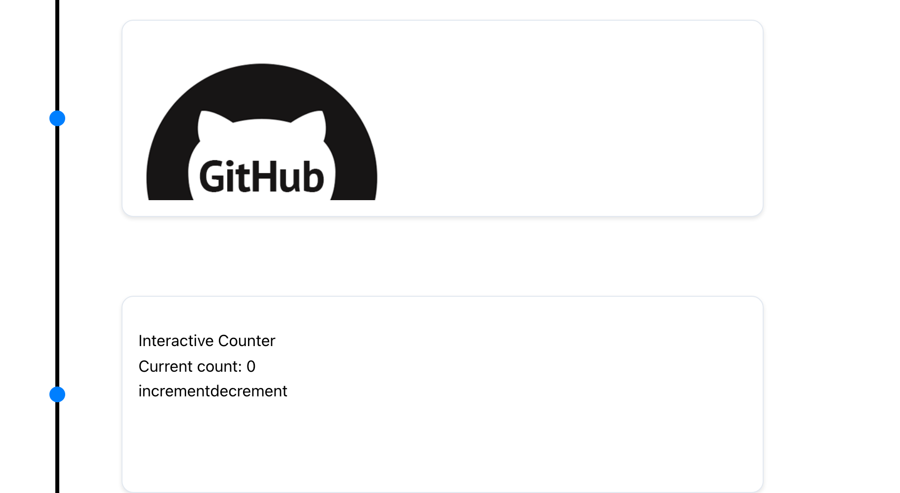

# Custom Card Rendering

React Chrono allows for custom rendering of timeline cards. By passing JSX elements as children to the `<Chrono>` component, you can replace the default card rendering with your own custom content.

This feature offers flexibility in how timeline data is presented, enabling unique and tailored user experiences.

## How It Works

When you provide child elements to the `<Chrono>` component, these elements are used to render the timeline cards sequentially.

-   If you pass custom content, it will be used for the initial cards.
-   If the number of custom content elements is less than the total number of items in the `items` prop, the remaining cards will be rendered using the default mechanism, picking data from the `items` array.

For instance, if you have an `items` array with 10 entries and provide 4 custom JSX elements, the first 4 cards will display your custom content. The subsequent 6 cards will render based on the data from `items[4]` to `items[9]`.

## Custom Content Format

Any valid JSX can be used for custom content. This includes:

-   Standard HTML tags (e.g., `<div>`, `<h1>`, `<p>`)
-   Custom React components

## Example

Below is an example demonstrating how to use custom rendering:

```jsx
import React from "react";
import { Chrono } from "react-chrono";

// Define custom content for the first two cards
const customContent = [
  <div key="card1">
    <h3>Custom Card 1</h3>
    <p>This is the first custom card with unique content.</p>
  </div>,
  <div key="card2">
    <h3>Custom Card 2</h3>
    <p>This is the second custom card, also uniquely rendered.</p>
  </div>,
];

// Define data for the timeline (can be more than custom content)
const items = [
  {
    title: "Event 1", // Corresponds to customContent[0]
    // Other props for item 1 can be provided but won't be used for default rendering if custom content is present
  },
  {
    title: "Event 2", // Corresponds to customContent[1]
  },
  {
    title: "Event 3",
    cardTitle: "Default Card 3",
    cardSubtitle: "Subtitle for Card 3",
    cardDetailedText: "Detailed text for the third card, rendered by default.",
  },
  // ... more items
];

function MyTimeline() {
  // Pass items and customContent as children
  return (
    <Chrono items={items} mode="vertical">
      {customContent}
    </Chrono>
  );
}

export default MyTimeline;
```

::: details Using v2.x Syntax (Still Supported)
```jsx
<Chrono items={items} mode="VERTICAL">
  {customContent}
</Chrono>
```
:::

In this example:
- The first two timeline cards will render `customContent[0]` and `customContent[1]`.
- The third card (and any subsequent cards) will use the default rendering mechanism based on the `items` array.

::: tip
Custom rendering is a powerful feature for tailoring the visual appearance and structure of your timeline cards. It allows for the integration of complex components or specific layouts that go beyond the default card structure.
:::



[](https://codesandbox.io/s/react-chrono-vertical-custom-qepnm?fontsize=14&hidenavigation=1&theme=dark)
