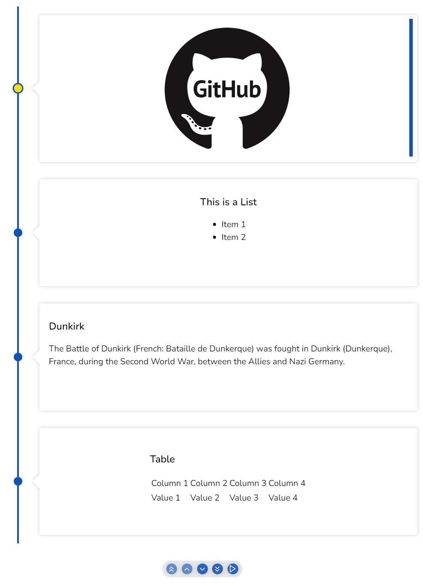

# Custom rendering

To use custom rendering , you need to pass the content that you want to render between the `<Chrono>` tags. The custom content will be used instead of the default rendering for each timeline card.

It's important to note that you can use both the items prop and custom rendering in conjunction. For example, if you have an array of 10 items and you pass 4 custom content between the `<Chrono>` tags, the first 4 timeline cards will have the custom content rendered, and the next 6 items will be picked from the items array starting from index 5.

## Custom Content Format

The custom content that you pass between the `<Chrono>` tags can be any valid JSX element, such as a `<div>`, `<h1>`, `<p>`, or any other HTML tag. You can also use React components as custom content.

## Custom Rendering Example

Here is an example of how to use custom rendering in React-Chrono:

```jsx
import React from "react";
import { Chrono } from "react-chrono";

const customContent = [
  <div>
    <h3>Custom Card 1</h3>
    <p>This is the first custom card</p>
  </div>,
  <div>
    <h3>Custom Card 2</h3>
    <p>This is the second custom card</p>
  </div>,
];

const items = [
  {
    title: "Item 1",
    cardTitle: "Card 1",
    cardSubtitle: "Subtitle 1",
    cardDetailedText: "Detailed text 1",
  },
  {
    title: "Item 2",
    cardTitle: "Card 2",
    cardSubtitle: "Subtitle 2",
    cardDetailedText: "Detailed text 2",
  },
  // ... more items
];

function MyTimeline() {
  return <Chrono items={items}>{customContent}</Chrono>;
}
```

In this example, we define an array of custom content that contains two `<div>` elements with custom content. Then we define an array of items that will be displayed in the timeline. We pass both the items array and the customContent array to the `<Chrono>` component. The first two timeline cards will use the custom content, and the next items will use the default rendering.

::: info
Custom rendering in React-Chrono provides a powerful way to customize the appearance of your timeline cards. By passing custom content between the `<Chrono>` tags, you can create unique and visually appealing timelines that fit your application's needs.
:::



[](https://codesandbox.io/s/react-chrono-vertical-custom-qepnm?fontsize=14&hidenavigation=1&theme=dark)
