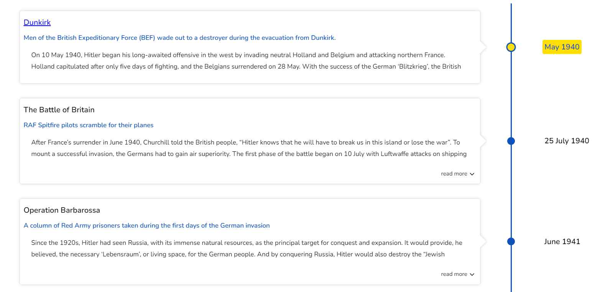
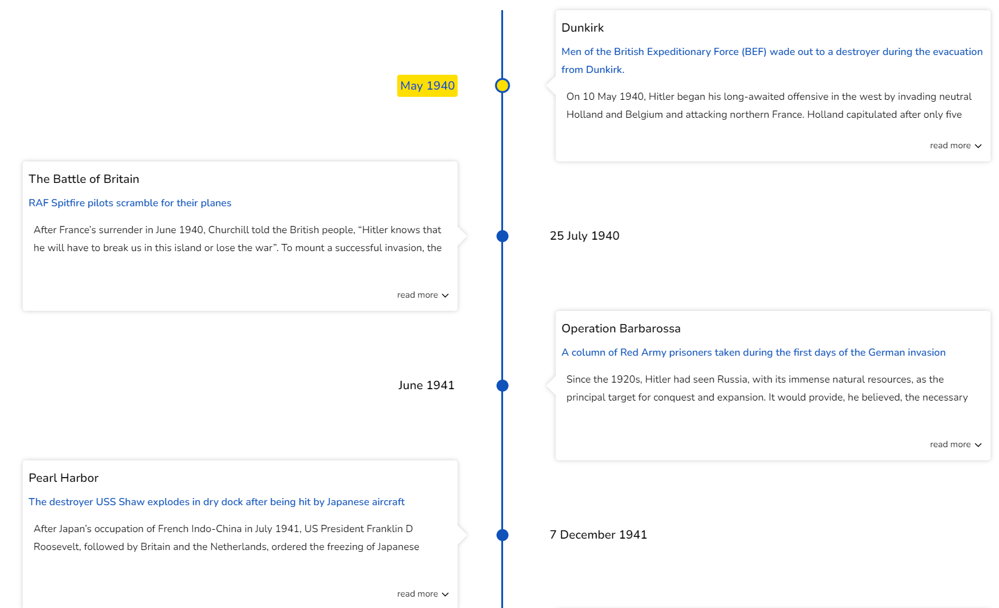

# Flip layout

The `flipLayout` prop flips the layout in all timeline modes. This is especially useful for apps and websites that read from right to left (RTL).

## Flip layout (Vertical)

```jsx
<Chrono
  items={data}
  mode="VERTICAL"
  flipLayout
/>
```



## Flip layout (Vertical Alternating)

```jsx
<Chrono
  items={data}
  mode="VERTICAL_ALTERNATING"
  flipLayout
/>
```

