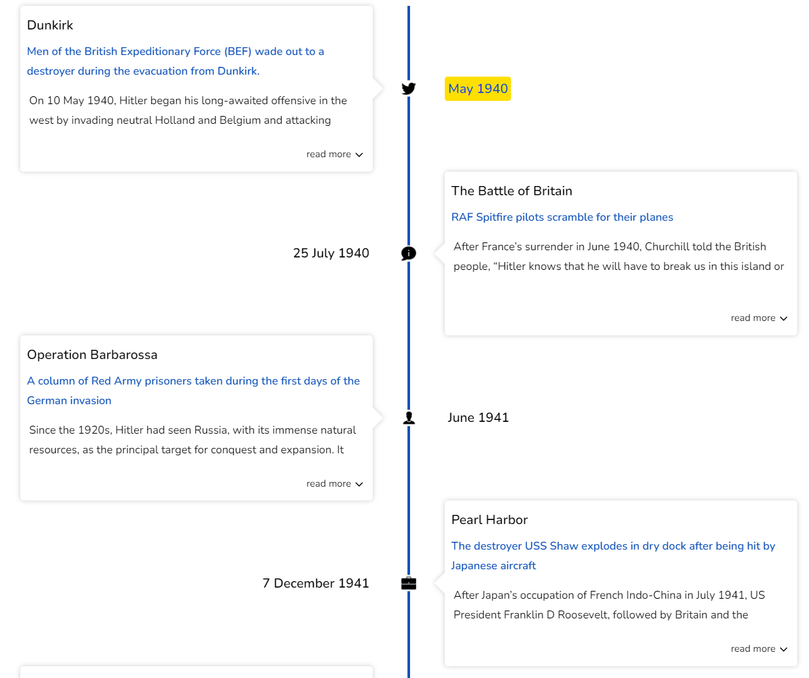

# Icons

The timeline track usually shows a CSS-generated shape for each time point, but it can be personalized to display distinct icons for each item on the track. To do so, place all the icons inside a wrapper with a chrono-icons class name. The component will then embed the icons on the corresponding timeline points in the same order they appear in the code.

```jsx
<Chrono items={data} mode="VERTICAL_ALTERNATING">
  <div className="chrono-icons">
    
    
    
    
    
    
    
  </div>
</Chrono>
```



[](https://codesandbox.io/s/react-chrono-custom-icons-x9s2k?fontsize=14&hidenavigation=1&theme=dark)
