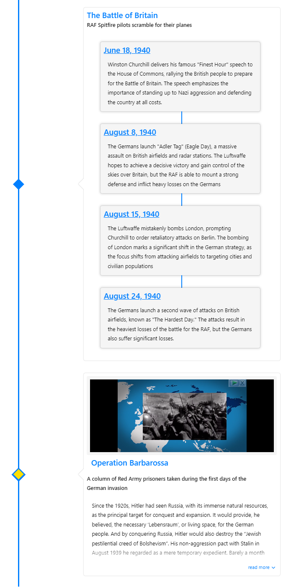

# Nested Timelines

Nested Timelines is a new feature in react-chrono that allows you to generate nested timelines on all modes. With this feature, you can create timelines within timelines, making it easy to organize and display complex data.

## Data-Driven

Nested Timelines in react-chrono is data-driven, which means that you can pass an items prop inside each item. The card will then render the nested timeline inside the card. This makes it easy to display a nested timeline for each item in your timeline.



## Example Usage

```jsx
import { Chrono } from "react-chrono";

const items = [
  {
    title: "Nested Timeline Example",
    cardTitle: "Main Event",
    cardSubtitle: "This is the main event",
    cardDetailedText: "This is the detailed text for the main event",
    media: {
      type: "IMAGE",
      source: {
        url: "https://picsum.photos/800/400",
      },
    },
    items: [
      {
        title: "Nested Item 1",
        cardTitle: "Nested Event 1",
        cardSubtitle: "This is a nested event",
        cardDetailedText: "This is the detailed text for the nested event 1",
        media: {
          type: "IMAGE",
          source: {
            url: "https://picsum.photos/800/400",
          },
        },
      },
      {
        title: "Nested Item 2",
        cardTitle: "Nested Event 2",
        cardSubtitle: "This is another nested event",
        cardDetailedText: "This is the detailed text for the nested event 2",
        media: {
          type: "IMAGE",
          source: {
            url: "https://picsum.photos/800/400",
          },
        },
      },
    ],
  },
];

function MyChrono() {
  return <Chrono items={items} mode="VERTICAL" nestedCardHeight={200} />;
}

export default MyChrono;
```

## Height Adjustments

With the `nestedCardHeight` prop, you can adjust the height of the nested card. This allows you to control the amount of space that the nested timeline takes up within the parent timeline.

## Derived Attributes

Other attributes, such as `mediaHeight` and `contentDetailsHeight`, are derived from the parent timeline. This makes it easy to create a nested timeline that looks and feels like part of the parent timeline.

Nesting is a powerful and flexible feature that allows you to create complex timelines with ease. Whether you're displaying data for a project, organizing events, or tracking progress.
