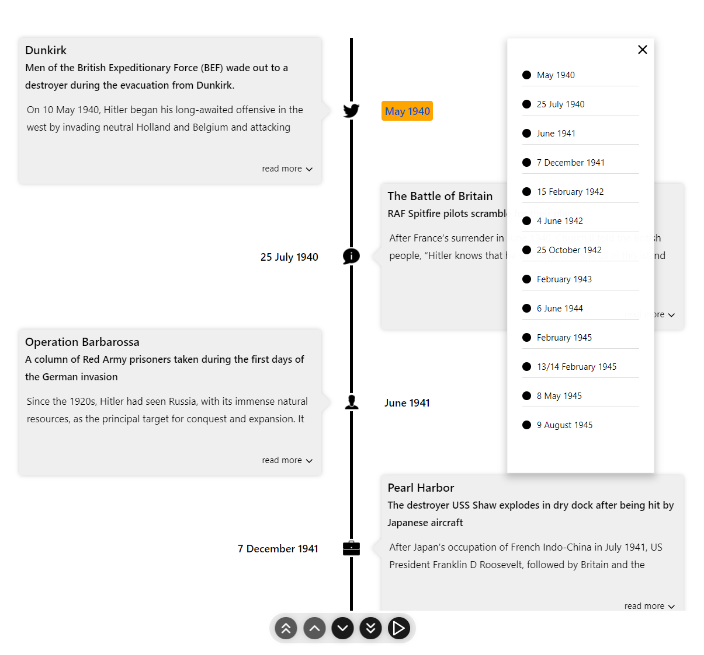

# Timeline Outline Navigation

React Chrono includes an outline feature that allows users to quickly navigate to specific items within the timeline. This is particularly useful for long timelines with many events.

The outline functionality is **automatically available** in `vertical` and `alternating` modes. An outline button appears in the top-left corner of the timeline (or top-right if the layout is [flipped](./flip-layout.md)). Clicking this button reveals a popover menu listing all timeline items.

## Using the Outline

The outline feature is enabled by default in vertical and alternating modes - no configuration needed:

```jsx
import React from "react";
import { Chrono } from "react-chrono";

const events = [
  {
    title: "Event 1 - January",
    cardTitle: "Planning Phase",
    cardSubtitle: "January 1, 2023",
  },
  {
    title: "Event 2 - February",
    cardTitle: "Development Start",
    cardSubtitle: "February 1, 2023",
  },
  {
    title: "Event 3 - March",
    cardTitle: "Alpha Release",
    cardSubtitle: "March 1, 2023",
  },
  // ... more events
];

function TimelineWithOutline() {
  return (
    <Chrono
      items={events}
      mode="vertical" // Outline is automatically available
    />
  );
}

export default TimelineWithOutline;
```

::: details Using v2.x Syntax (Still Supported)
```jsx
<Chrono
  items={events}
  mode="vertical" // Or "alternating"
/>
```
:::

::: tip Note
The outline functionality is **only** available in `vertical` and `alternating` modes. In `horizontal` or `horizontal-all` modes, the outline button is not displayed.
:::

## Using the Popover Menu

Once enabled, the outline button (often a hamburger icon or similar) will be visible.
-   **Clicking the button**: Opens a popover menu.
-   **Popover Content**: The menu lists all timeline items, typically using their `title` property. The currently active/visible item in the timeline is usually highlighted in the popover.
-   **Navigation**: Clicking on an item in the popover menu will smoothly scroll the timeline to that specific item.



## Listening to Outline Selections

You can listen to outline selection events using the `onOutlineSelection` callback:

```jsx
function TimelineWithOutlineCallback() {
  const handleOutlineSelection = (index) => {
    console.log(`User selected item ${index} from the outline`);
    // You can track analytics, update state, etc.
  };

  return (
    <Chrono
      items={events}
      mode="vertical"
      onOutlineSelection={handleOutlineSelection}
    />
  );
}
```

### Callback Parameters

| Parameter | Type | Description |
|-----------|------|-------------|
| `index` | `number` | Zero-based index of the selected timeline item |

The outline feature significantly improves navigation for extensive timelines, providing users with a quick overview and direct access to any event.
