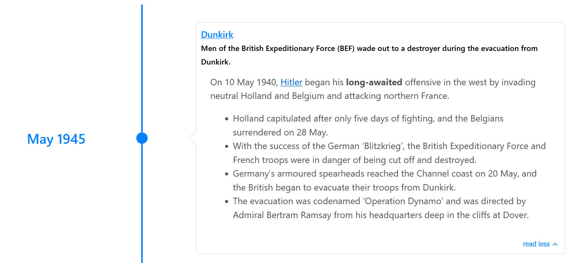

# Render HTML content in the timeline cards

The `parseDetailsAsHTML` property allows you to render HTML content in the timeline cards. This can be useful for displaying formatted text, images, videos, and other media.

## Usage

To use the `parseDetailsAsHTML` property, set it to `true` in your React-Chrono component. Here's an example:

```jsx
import React from "react";
import { Chrono } from "react-chrono";

const events = [
  {
    title: 'May 1945',
    cardTitle: 'Dunkirk',
    url: 'http://www.history.com',
    media: {
      name: 'dunkirk beach',
      source: {
        url: 'https://i2-prod.mirror.co.uk/incoming/article10847802.ece/ALTERNATES/s810/PAY-Dunkirk-in-colour.jpg',
      },
      type: 'IMAGE',
    },
    cardSubtitle:
      'Men of the British Expeditionary Force (BEF) wade out to a destroyer during the evacuation from Dunkirk.',
    cardDetailedText: [
      `On 10 May 1940, <a href="http://www.google.com">Hitler</a> began his <strong>long-awaited</strong> offensive in the west by invading neutral Holland and Belgium and attacking northern France.
      <br>`,
      `<ul>
        <li>Holland capitulated after only five days of fighting, and the Belgians surrendered on 28 May.</li>
        <li>With the success of the German ‘Blitzkrieg’, the British Expeditionary Force and French troops were in danger of being cut off and destroyed.</li>
        <li>
        Germany’s armoured spearheads reached the Channel coast on 20 May, and the British began to evacuate their troops from Dunkirk.
        </li>
        <li>
        The evacuation was codenamed ‘Operation Dynamo’ and was directed by Admiral Bertram Ramsay from his headquarters deep in the cliffs at Dover.
        </li>
      </ul>
      `,
    ],
  },
];

function MyComponent() {
  return <Chrono items={events} mode="VERTICAL" enableOutline  parseDetailsAsHTML/>;
}

export default MyComponent;
```

In this example, the `parseDetailsAsHTML` property is set to `true` for a vertical timeline.

::: info
`parseDetailsAsHTML` is not enabled by default, so you must set it to `true` if you want to render HTML content in the timeline cards. The library uses xss to sanitize the HTML content, so you don't have to worry about malicious code being injected into your application.
:::


