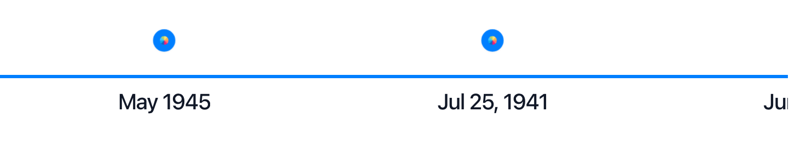

# Slideshow Mode

React Chrono includes a slideshow feature that automatically transitions through timeline cards. This is available in all timeline modes.



## Enabling Slideshow (v3.0 Grouped API)

Use the `animation.slideshow` configuration to enable and customize slideshow behavior:

```jsx
<Chrono
  items={items}
  animation={{
    slideshow: {
      enabled: true,
      duration: 3000  // Each card shows for 3 seconds
    }
  }}
/>
```

::: details Using v2.x Syntax (Still Supported)
```jsx
<Chrono items={items} slideShow={true} slideItemDuration={3000} />
```
:::

## Configuring Slide Duration

The `duration` property (or `slideItemDuration` in v2.x) controls how long each timeline card is displayed before transitioning to the next. This value is specified in milliseconds.

```jsx
<Chrono
  items={items}
  animation={{
    slideshow: {
      enabled: true,
      duration: 4000  // 4 seconds per card
    }
  }}
/>
```

## Slideshow Animation Types

React Chrono offers different animation types for slideshow transitions:

-   **`reveal`**: Timeline cards are revealed one after another with a fade-in effect
-   **`fade`**: Cards animate in from alternating sides (previously `slide_from_sides` in v2.x)
-   **`slide`**: Cards slide into view (previously `slide_in` in v2.x)

### v3.0 Syntax

```jsx
<Chrono
  items={items}
  animation={{
    slideshow: {
      enabled: true,
      type: 'fade'  // or 'reveal', 'slide'
    }
  }}
/>
```

::: details Using v2.x Syntax (Still Supported)
```jsx
<Chrono
  items={items}
  slideShow={true}
  slideShowType="slide_from_sides"  // Old values still work
/>
```

**Note:** v2.x values are automatically converted:
- `'slide_in'` → `'slide'`
- `'slide_from_sides'` → `'fade'`
- `'reveal'` → `'reveal'` (unchanged)
:::

## Overall Progress Bar

React Chrono includes an overall progress bar that shows the global progress across all timeline items during slideshow mode.

### v3.0 Syntax

```jsx
<Chrono
  items={items}
  animation={{
    slideshow: {
      enabled: true,
      duration: 3000,
      showOverallProgress: true  // Default: true when enabled
    }
  }}
/>
```

::: details Using v2.x Syntax (Still Supported)
```jsx
<Chrono
  items={items}
  slideShow={true}
  showOverallSlideshowProgress={true}
/>
```
:::

The progress bar appears at the top of the screen and can be disabled by setting `showOverallProgress: false`.

## Controlling the Slideshow

Users can typically control the slideshow via the control panel (if enabled):
-   **Play/Pause Button**: Starts or stops the automatic progression of the slideshow.
-   **Escape Key**: Pressing the "Escape" key on the keyboard usually stops/cancels the slideshow.

## Example Usage

### v3.0 Syntax (Recommended)

```jsx
import React from "react";
import { Chrono } from "react-chrono";

const slideshowItems = [
  {
    title: "2020 - The Beginning",
    cardTitle: "Project Inception",
    cardSubtitle: "Ideas and Concepts",
    cardDetailedText: "Initial brainstorming and planning phase for the new project.",
    media: {
      type: "IMAGE",
      source: {
        url: "https://picsum.photos/id/1018/1000/600",
      },
    },
  },
  {
    title: "2021 - Development",
    cardTitle: "Building the Core",
    cardSubtitle: "Coding and Prototyping",
    cardDetailedText: "Intensive development period, focusing on core features and functionality.",
    media: {
      type: "IMAGE",
      source: {
        url: "https://picsum.photos/id/1015/1000/600",
      },
    },
  },
  {
    title: "2022 - Launch",
    cardTitle: "Product Release",
    cardSubtitle: "Going Live",
    cardDetailedText: "Successful launch of the product to the market, gathering user feedback.",
    media: {
      type: "IMAGE",
      source: {
        url: "https://picsum.photos/id/1016/1000/600",
      },
    },
  },
];

function MyTimelineSlideshow() {
  return (
    <Chrono
      items={slideshowItems}
      mode="horizontal"
      animation={{
        slideshow: {
          enabled: true,
          duration: 4000,
          type: 'fade',
          showProgress: true
        }
      }}
    />
  );
}

export default MyTimelineSlideshow;
```

### Interactive Demo

<SlideshowDemo />

::: details Using v2.x Syntax (Still Supported)
```jsx
<Chrono
  items={slideshowItems}
  mode="horizontal"
  slideShow={true}
  slideItemDuration={4000}
  slideShowType="slide_from_sides"
/>
```
:::

The timeline will automatically cycle through `slideshowItems`, displaying each for 4 seconds.

The slideshow feature is excellent for creating automated presentations or guided tours of timeline events, making your content more dynamic and engaging.
