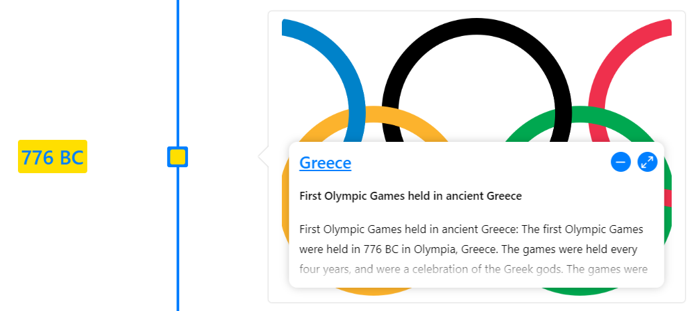
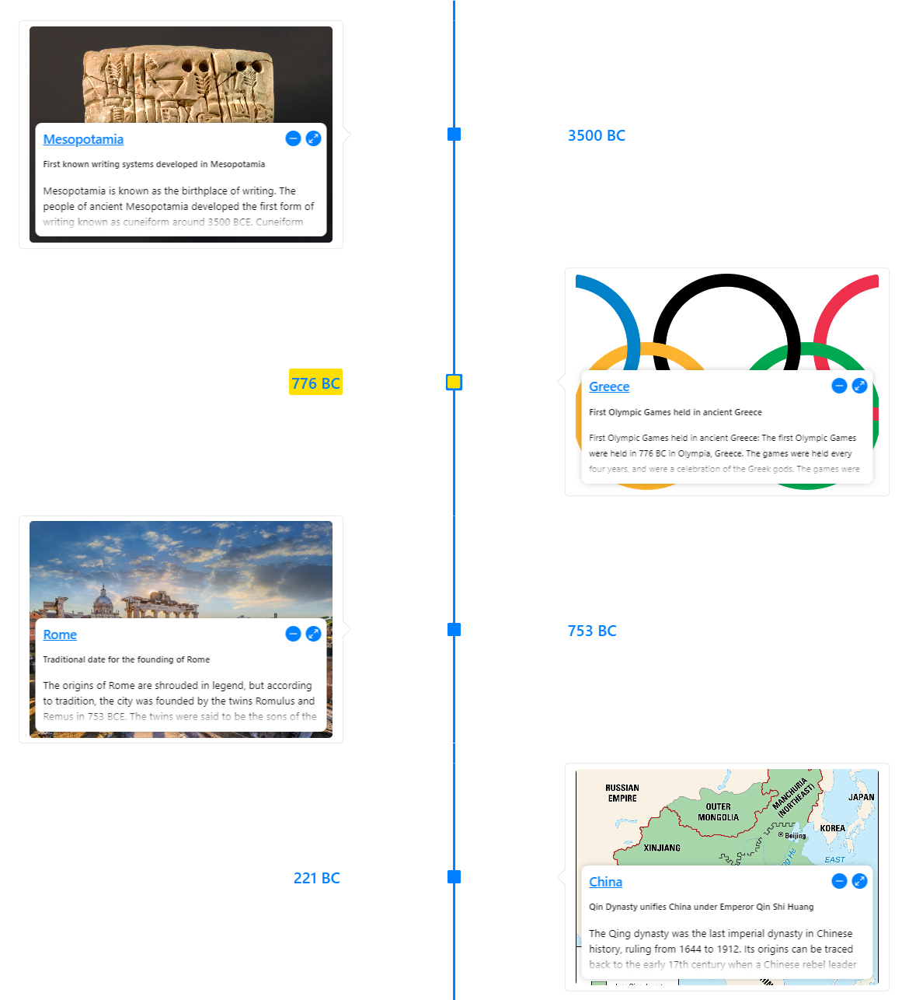

# Text Overlay on Media

React Chrono offers a `textOverlay` mode, which enhances the presentation of timeline cards that contain media (images or videos). When enabled, the card's text content (like title, subtitle, and detailed text) is overlaid directly on top of the media.

This mode provides a modern and immersive user experience, especially for media-rich timelines.



## Key Features of Text Overlay Mode

-   **Integrated Display**: Text content is rendered on top of the media, creating a cohesive visual unit. This is particularly effective for visually striking images or videos where the text can provide context without distracting from the media itself.
-   **Enhanced User Experience**: Offers a more engaging way to present information, allowing users to consume both media and text simultaneously.
-   **UI Controls for Text Visibility**: Includes UI controls (often appearing on hover or interaction) that allow users to maximize or minimize the text display. This gives users control over how much text is visible, enabling them to focus on the media when desired.

## Usage

To enable text overlay, add the `textOverlay` boolean prop to the `<Chrono>` component and set it to `true`. This prop primarily affects timeline items that include a `media` object.

```jsx
import React from "react";
import { Chrono } from "react-chrono";

const itemsWithMediaForOverlay = [
  {
    title: "Discovery - 2021",
    cardTitle: "Exploring New Horizons",
    cardSubtitle: "A journey into the unknown",
    cardDetailedText: "This phase involved extensive research and exploration, uncovering new possibilities and challenges. The visual media captures the essence of this discovery period.",
    media: {
      type: "IMAGE",
      source: {
        url: "https://picsum.photos/seed/discovery/800/400", // Placeholder image
      },
    },
  },
  {
    title: "Innovation - 2022",
    cardTitle: "Breakthrough Ideas",
    cardSubtitle: "Transforming concepts into reality",
    cardDetailedText: "Key innovations were developed during this period, leading to significant advancements. The overlay text provides context to the visual representation of these breakthroughs.",
    media: {
      type: "IMAGE",
      source: {
        url: "https://picsum.photos/seed/innovation/800/400", // Placeholder image
      },
    },
  },
  // ... more items
];

function TimelineWithTextOverlay() {
  return (
    <Chrono
      items={itemsWithMediaForOverlay}
      mode="VERTICAL" // Works in all modes
      textOverlay={true} // Enable text overlay
    />
  );
}

export default TimelineWithTextOverlay;
```

## How It Affects Presentation

-   When `textOverlay` is active, the layout of the card changes significantly. Instead of text appearing beside or below the media, it's layered on top.
-   The feature is designed to be responsive and visually appealing, but you may need to consider the contrast between your text color and media content for readability. Theme customizations might be necessary.



The `textOverlay` mode is a powerful tool for creating visually stunning timelines that prioritize media content while still providing essential textual information in an integrated manner.
