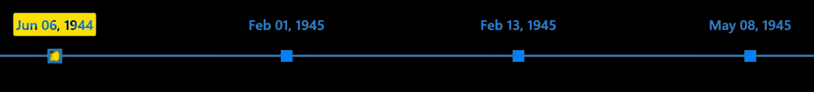

# Customizing Timeline Points

A Timeline Point is the visual marker on the timeline track that represents an individual event or moment. React Chrono offers several ways to customize the appearance of these points.



## Supported Shapes

You can change the shape of the timeline points using the `display.pointShape` configuration. The available built-in shapes are:

-   `circle` (Default)
-   `diamond`
-   `square`

### v3.0 Syntax (Recommended)
```jsx
<Chrono
  items={items}
  display={{
    pointShape: 'square'
  }}
/>
```

::: details Using v2.x Syntax (Still Supported)
```jsx
<Chrono items={items} timelinePointShape="square" />
```
:::

## Adjusting Dimensions

The size of the timeline point can be modified using the `layout.pointSize` configuration. This prop accepts a numerical value representing both the width and height of the point in pixels.

### v3.0 Syntax (Recommended)
```jsx
<Chrono
  items={items}
  layout={{
    pointSize: 20  // Sets point size to 20x20 pixels
  }}
/>
```

::: details Using v2.x Syntax (Still Supported)
```jsx
<Chrono items={items} timelinePointDimension={20} />
```
:::

The default dimension is typically around `16px`, but this can vary slightly based on theme or specific version.

## Using Custom Icons as Timeline Points

If the built-in shapes are not sufficient, you can use custom icons (e.g., images, SVGs) as timeline points. This provides maximum flexibility for visual customization.

For detailed instructions on how to implement custom icons, please refer to the [Custom Timeline Icons](./icons.md) documentation page.

## Example: Combining Shape and Dimension Customization

Here's an example showing how to set both the shape and dimension for timeline points:

### v3.0 Syntax (Recommended)

```jsx
import React from "react";
import { Chrono } from "react-chrono";

const sampleItems = [
  {
    title: "Event A",
    cardTitle: "Card for Event A",
    cardSubtitle: "Subtitle A",
    cardDetailedText: "Details for event A.",
  },
  {
    title: "Event B",
    cardTitle: "Card for Event B",
    cardSubtitle: "Subtitle B",
    cardDetailedText: "Details for event B.",
  },
  {
    title: "Event C",
    cardTitle: "Card for Event C",
    cardSubtitle: "Subtitle C",
    cardDetailedText: "Details for event C.",
  },
];

function CustomizedTimelinePoints() {
  return (
    <Chrono
      items={sampleItems}
      mode="alternating"
      display={{
        pointShape: 'diamond'  // Set points to be diamonds
      }}
      layout={{
        pointSize: 24  // Set point size to 24x24 pixels
      }}
    />
  );
}

export default CustomizedTimelinePoints;
```

::: details Using v2.x Syntax (Still Supported)
```jsx
<Chrono
  items={sampleItems}
  mode="alternating"
  timelinePointShape="diamond"
  timelinePointDimension={24}
/>
```
:::

In this configuration:
-   The `display.pointShape` is set to `"diamond"`, changing the points from the default circles.
-   The `layout.pointSize` is set to `24`, making the diamond points 24px wide and 24px high.

By customizing the shape, dimension, or even using entirely custom icons, you can significantly alter the visual style of the timeline track to better suit your application's design.
