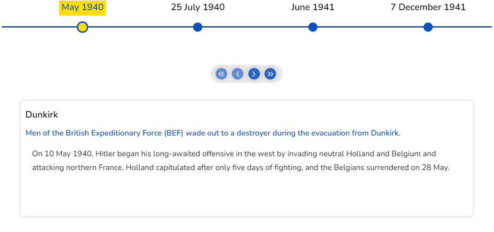

# Horizontal

When horizontal mode is selected, the timeline cards will be presented in a horizontal format. You have the option, while in the horizontal mode, to display either just the active card or all of the cards.

## Default

In the default mode, only the active card is displayed.

```jsx
  <Chrono items={data} mode="HORIZONTAL" />
```



[](https://codesandbox.io/s/keen-shannon-gtjwn?fontsize=14&hidenavigation=1&theme=dark)

## Show all cards

use the `showAllCardsHorizontal` property to display all the cards.

```jsx{4}
  <Chrono
    items={data}
    mode="HORIZONTAL"
    showAllCardsHorizontal
  />
```


[](https://codesandbox.io/s/show-all-cards-5vuf2x?fontsize=14&hidenavigation=1&theme=dark)
