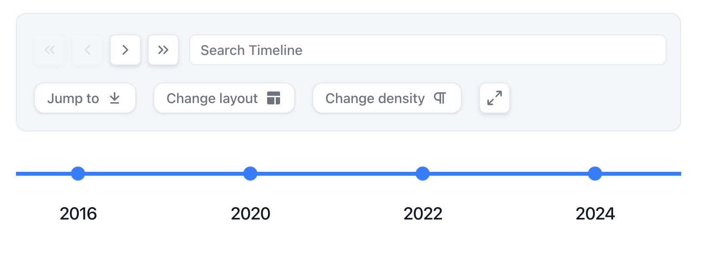
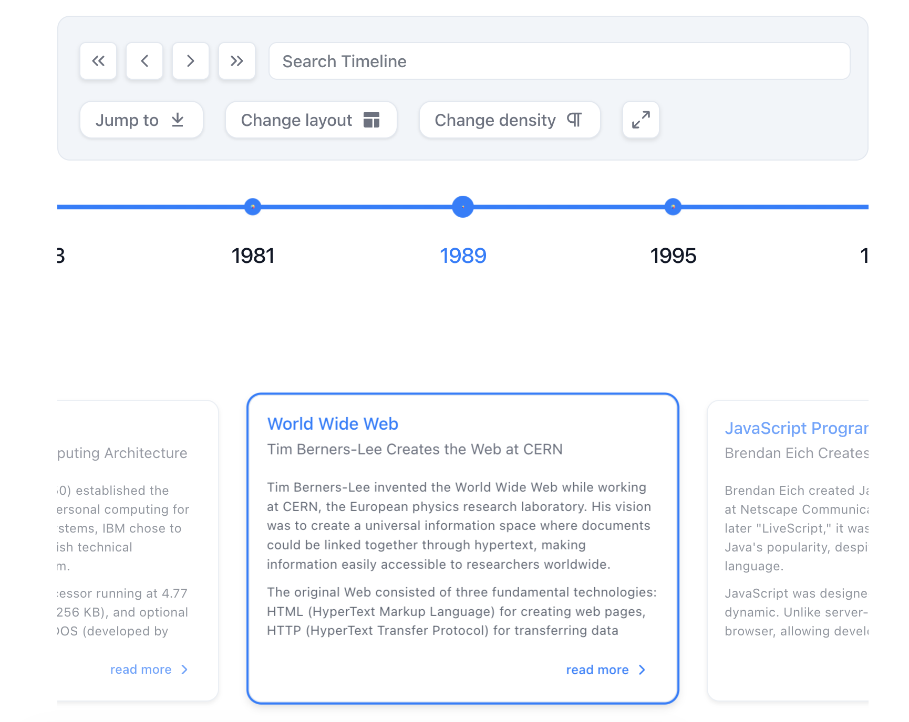

# Horizontal Mode

In horizontal mode, React-Chrono displays timeline cards horizontally, providing users with a new and visually distinct way to display events. By default, only one timeline card is displayed at a time. Users can navigate through the cards using the navigation arrows or the keyboard.



To display all the timeline cards at once, use the `horizontal-all` mode. This enables users to scroll through the entire timeline horizontally and view all the timeline cards simultaneously.



## Adjusting the Space Between Timeline Cards

React-Chrono's horizontal mode allows you to adjust the space between each timeline item using the `layout.itemWidth` configuration. This value (in pixels) sets the width of each timeline section, allowing you to customize the distance between each card.

## Example - Standard Horizontal Mode (v3.0)

```jsx
import React from 'react';
import { Chrono } from 'react-chrono';

const items = [
  {
    title: "January 2022",
    cardTitle: "Event 1",
    cardSubtitle: "Event 1 Subtitle",
    cardDetailedText: "This is the first event on the timeline.",
  },
  {
    title: "February 2022",
    cardTitle: "Event 2",
    cardSubtitle: "Event 2 Subtitle",
    cardDetailedText: "This is the second event on the timeline.",
  },
  {
    title: "March 2022",
    cardTitle: "Event 3",
    cardSubtitle: "Event 3 Subtitle",
    cardDetailedText: "This is the third event on the timeline.",
  }
];

const HorizontalTimeline = () => {
  return (
    <Chrono
      items={items}
      mode="horizontal"
      layout={{
        itemWidth: 150
      }}
    />
  );
};

export default HorizontalTimeline;
```

### Interactive Demo

<HorizontalTimelineDemo />

::: details Using v2.x Syntax (Still Supported)
```jsx
<Chrono
  items={items}
  mode="HORIZONTAL"
  itemWidth={150}
/>
```
:::

## Example - Show All Cards Horizontally

To display all cards at once in horizontal mode, use the `horizontal-all` mode:

```jsx
const HorizontalAllTimeline = () => {
  return (
    <Chrono
      items={items}
      mode="horizontal-all"
      layout={{
        itemWidth: 150
      }}
    />
  );
};
```

::: details Using v2.x Syntax (Still Supported)
```jsx
<Chrono
  items={items}
  mode="HORIZONTAL"
  showAllCardsHorizontal={true}
  itemWidth={150}
/>
```
:::

In the examples above, `layout.itemWidth` is set to 150, which creates a space of 150 pixels between each timeline section. The standard `horizontal` mode displays one card at a time, while `horizontal-all` mode displays all cards simultaneously.
