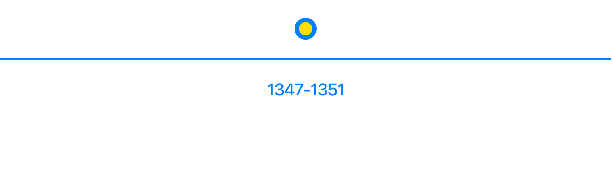

# Horizontal Mode

In horizontal mode, React-Chrono displays timeline cards horizontally, providing users with a new and visually distinct way to display events. By default, only one timeline card is displayed at a time. Users can navigate through the cards using the navigation arrows or the keyboard.

To display all the timeline cards at once, developers can set the `showAllCardsHorizontal` prop to true. This prop enables users to scroll through the entire timeline horizontally and view all the timeline cards.



## Adjusting the Space Between Timeline Cards

React-Chrono's horizontal mode also allows developers to adjust the space between each timeline item using the itemWidth prop. This prop accepts a value in pixels and sets the width of each timeline card, allowing developers to customize the distance between each card.

## Example

```jsx
import React from 'react';
import { Chrono } from 'react-chrono';

const items = [
  {
    title: "January 2022",
    cardTitle: "Event 1",
    cardSubtitle: "Event 1 Subtitle",
    cardDetailedText: "This is the first event on the timeline.",
  },
  {
    title: "February 2022",
    cardTitle: "Event 2",
    cardSubtitle: "Event 2 Subtitle",
    cardDetailedText: "This is the second event on the timeline.",
  },
  {
    title: "March 2022",
    cardTitle: "Event 3",
    cardSubtitle: "Event 3 Subtitle",
    cardDetailedText: "This is the third event on the timeline.",
  }
];

const HorizontalTimeline = () => {
  return (
    <Chrono
      items={items}
      mode="HORIZONTAL"
      itemWidth={150}
      showSingle={true}
    />
  );
};

export default HorizontalTimeline;
```

In the example above, the `itemWidth` prop is set to 150, which creates a space of 150 pixels between each timeline card. The showSingle prop is set to true, which displays only one timeline card at a time.
