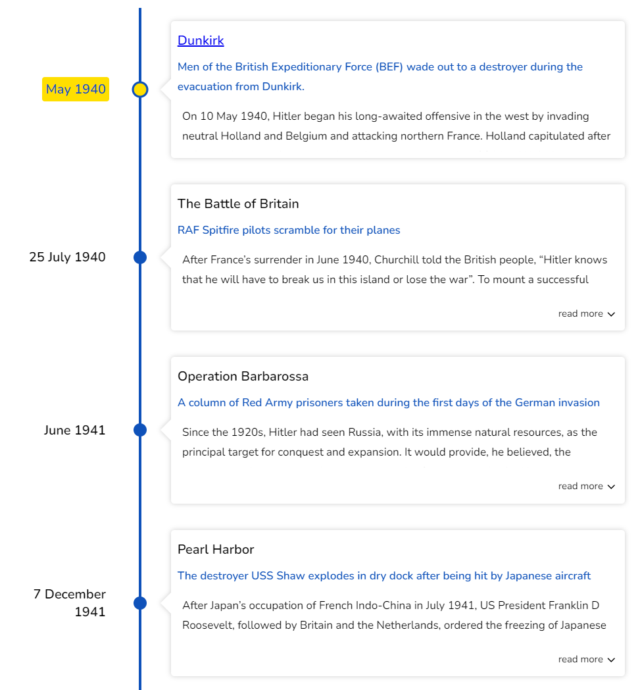
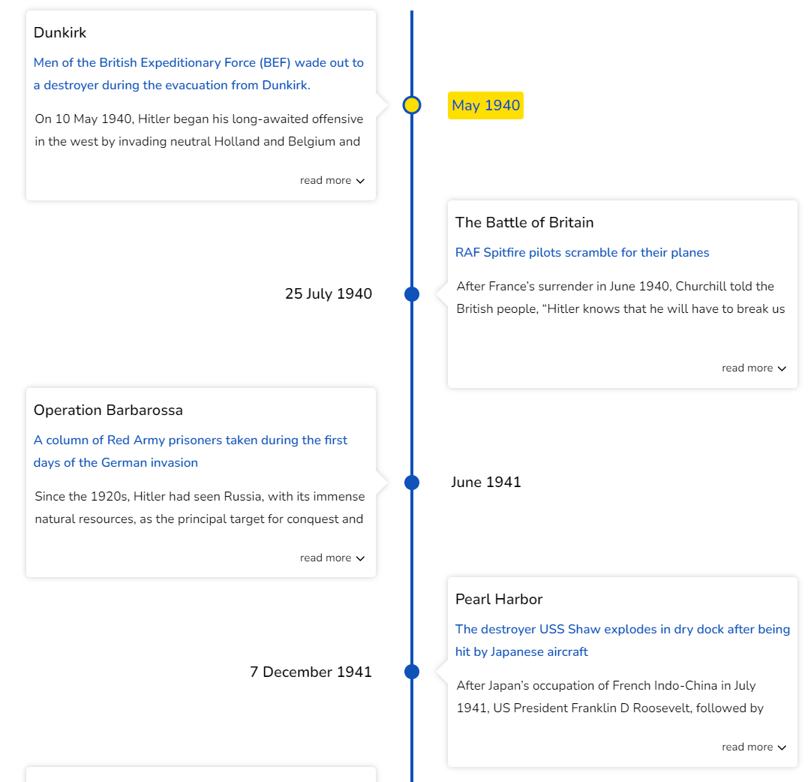

# Vertical

In vertical mode, the timeline cards are arranged vertically. When using the vertical mode, the cards can be rendered in either a single column or in a two-column format with cards placed side-by-side.

## Single column

In single column mode, the cards are rendered in a single column. set the `mode` to `VERTICAL` to render the timeline in vertical mode.

```jsx{3}
  <Chrono
    items={data}
    mode="VERTICAL"
  />
```



## Two column

When you need to render Timeline cards side by side, two column rendering comes in handy.

To render the cards in two columns, you need to set the `mode` to `VERTICAL_ALTERNATING`.

```jsx{3}
  <Chrono
    items={data}
    mode="VERTICAL_ALTERNATING"
    twoColumns
  />
```


