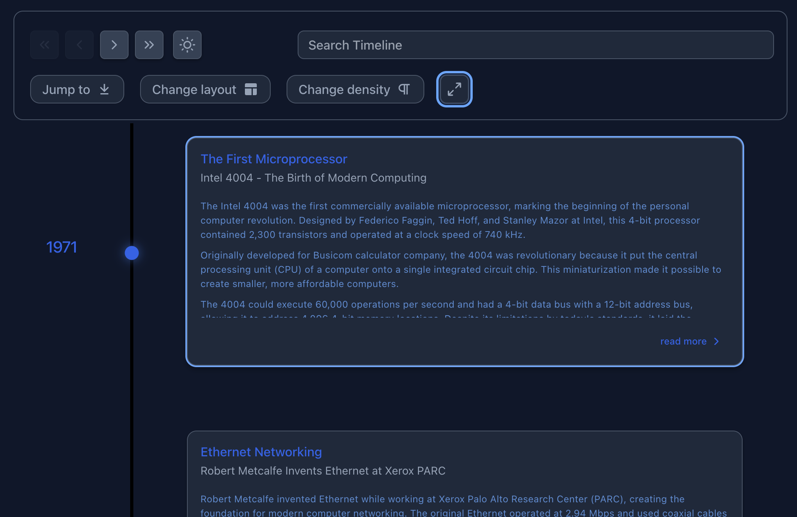
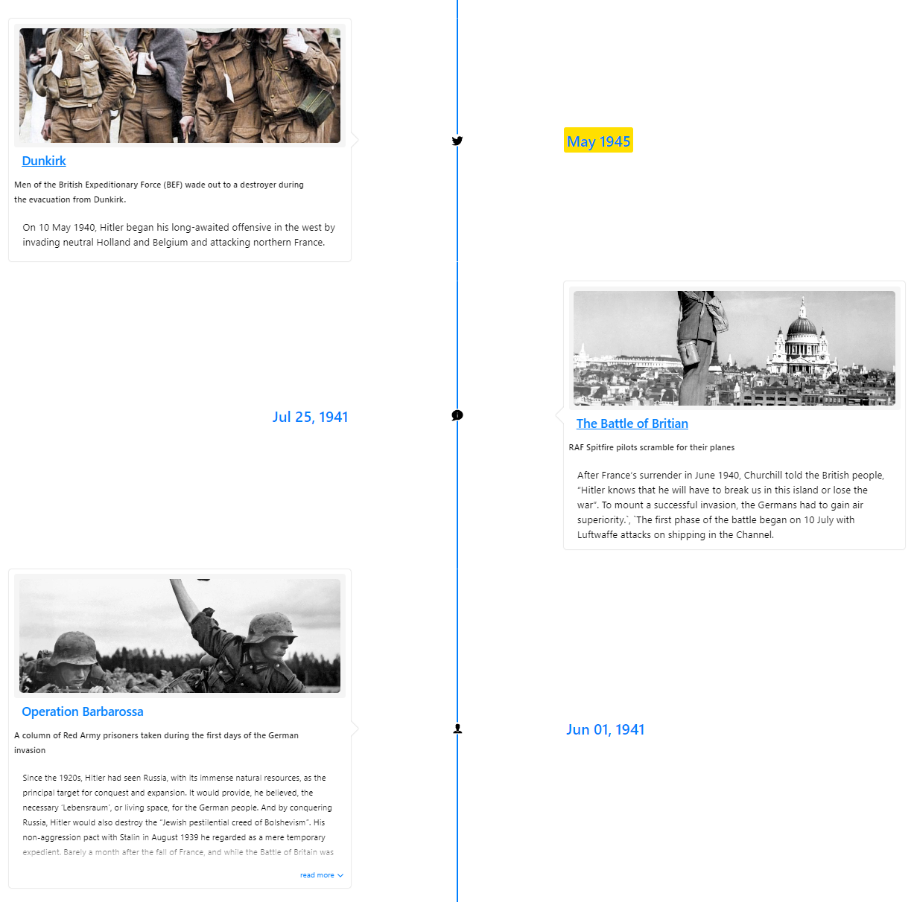

# Vertical Modes

## Vertical Timeline

In vertical mode, events are displayed in a vertical orientation. Each event is represented by a card that contains a title, subtitle, and content. The cards are stacked on top of each other, with the latest event at the top.

Example (v3.0):

```jsx
import { Chrono } from 'react-chrono';

const items = [
  {
    title: "January 2022",
    cardTitle: "Event 1",
    cardSubtitle: "Event 1 Subtitle",
    cardDetailedText: "This is the first event on the timeline.",
  },
  {
    title: "February 2022",
    cardTitle: "Event 2",
    cardSubtitle: "Event 2 Subtitle",
    cardDetailedText: "This is the second event on the timeline.",
  },
  {
    title: "March 2022",
    cardTitle: "Event 3",
    cardSubtitle: "Event 3 Subtitle",
    cardDetailedText: "This is the third event on the timeline.",
  }
];

const VerticalTimeline = () => {
  return (
    <Chrono
      items={items}
      mode="vertical"
    />
  );
};

export default VerticalTimeline;
```

### Interactive Demo

<VerticalTimelineDemo />

::: details Using v2.x Syntax (Still Supported)
```jsx
<Chrono
  items={items}
  mode="VERTICAL"
/>
```
:::



## Vertically Alternating Timeline

In alternating mode, events are displayed in a vertical orientation with alternating positions. This creates a zigzag pattern that can be visually appealing. Each event is represented by a card that contains a title, subtitle, and content. The cards are stacked on top of each other with cards alternating between left and right sides.

Example (v3.0):

```jsx
import { Chrono } from "react-chrono";

const items = [
  {
    title: "January 2022",
    cardTitle: "Event 1",
    cardSubtitle: "Event 1 Subtitle",
    cardDetailedText: "This is the first event on the timeline.",
  },
  {
    title: "February 2022",
    cardTitle: "Event 2",
    cardSubtitle: "Event 2 Subtitle",
    cardDetailedText: "This is the second event on the timeline.",
  },
  {
    title: "March 2022",
    cardTitle: "Event 3",
    cardSubtitle: "Event 3 Subtitle",
    cardDetailedText: "This is the third event on the timeline.",
  }
];

const VerticalAlternatingTimeline = () => {
  return (
    <Chrono
      items={items}
      mode="alternating"
      layout={{
        itemWidth: 150
      }}
    />
  );
};

export default VerticalAlternatingTimeline;
```

### Interactive Demo

<AlternatingTimelineDemo />

::: details Using v2.x Syntax (Still Supported)
```jsx
<Chrono
  items={items}
  mode="VERTICAL_ALTERNATING"
  itemWidth={150}
/>
```
:::


