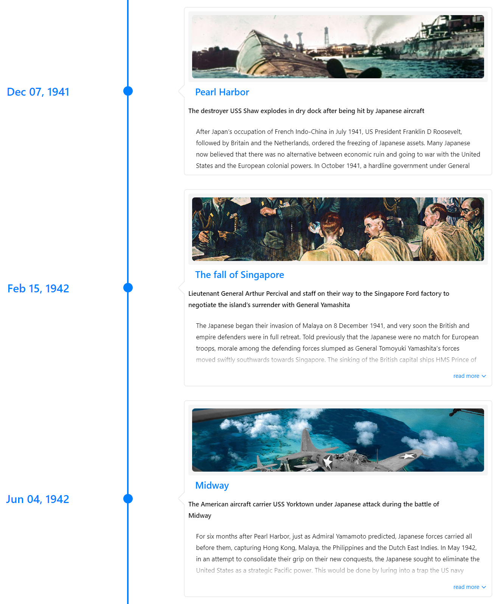
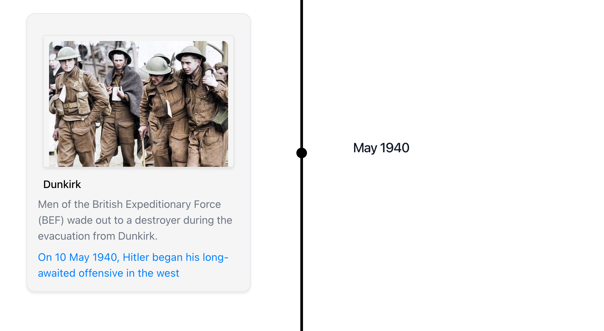

# Vertical Modes

## Vertical Timeline

In VERTICAL mode, events are displayed in a vertical orientation. Each event is represented by a card that contains a title, subtitle, and content. The cards are stacked on top of each other, with the latest event at the top.

Example:

```jsx
Copy code
import { Chrono } from 'react-chrono';

const events = [
  {
    title: 'Event 1',
    subtitle: 'May 2022',
    contentTitle: 'Content 1',
    contentText: 'Lorem ipsum dolor sit amet, consectetur adipiscing elit. Sed euismod blandit ante, sit amet consequat est laoreet vel.'
  },
  {
    title: 'Event 2',
    subtitle: 'June 2022',
    contentTitle: 'Content 2',
    contentText: 'Lorem ipsum dolor sit amet, consectetur adipiscing elit. Sed euismod blandit ante, sit amet consequat est laoreet vel.'
  },
  {
    title: 'Event 3',
    subtitle: 'July 2022',
    contentTitle: 'Content 3',
    contentText: 'Lorem ipsum dolor sit amet, consectetur adipiscing elit. Sed euismod blandit ante, sit amet consequat est laoreet vel.'
  },
];

function App() {
  return (
    <Chrono items={events} mode="VERTICAL" />
  );
}
```



## Vertically Alternating Timeline

In VERTICAL_ALTERNATING mode, events are displayed in a vertical orientation, but with alternating positions. This creates a zigzag pattern that can be visually appealing. Each event is represented by a card that contains a title, subtitle, and content. The cards are stacked on top of each other, with the latest event at the top.

Example:

```jsx
import { Chrono } from "react-chrono";

const events = [
  {
    title: "Event 1",
    subtitle: "May 2022",
    contentTitle: "Content 1",
    contentText:
      "Lorem ipsum dolor sit amet, consectetur adipiscing elit. Sed euismod blandit ante, sit amet consequat est laoreet vel.",
  },
  {
    title: "Event 2",
    subtitle: "June 2022",
    contentTitle: "Content 2",
    contentText:
      "Lorem ipsum dolor sit amet, consectetur adipiscing elit. Sed euismod blandit ante, sit amet consequat est laoreet vel.",
  },
  {
    title: "Event 3",
    subtitle: "July 2022",
    contentTitle: "Content 3",
    contentText:
      "Lorem ipsum dolor sit amet, consectetur adipiscing elit. Sed euismod blandit ante, sit amet consequat est laoreet vel.",
  },
];

function App() {
  return <Chrono items={events} mode="VERTICAL_ALTERNATING" />;
}
```


